# Context Mapping

Context Maps describe the contact between bounded contexts and teams with a collection of patterns. There are nine context map patterns and three different team relationships. The context map patterns describe a variety of perspectives like service provisioning, model propagation or governance aspects. This diversity of perspectives enables you to get an holistic overview of team and bounded context relationships.

Context Maps can be used to analyze existing systems or application landscapes but they are also suitable for upfront design considerations. However, we have realized that many folks struggle to get started with the context mapping patterns based on the definitions in the exsiting DDD books. This GitHub repository aims to give you some help with context maps with a cheat sheet and a starter kit for Miro.

## Overview of the context map team relationships and patterns

### Team Relationships

#### Mutually Dependent

Two teams or bounded contexts are mutually dependent when their software artifacts or systems need to be delivered together to be successful and work. You will often see a close, reciprocal link between data, functionality and capabilities of these teams. Those teams also need a lot of communication between each ofther in order to coordinate their efforts (see Partnership pattern).

#### Upstream Downstream

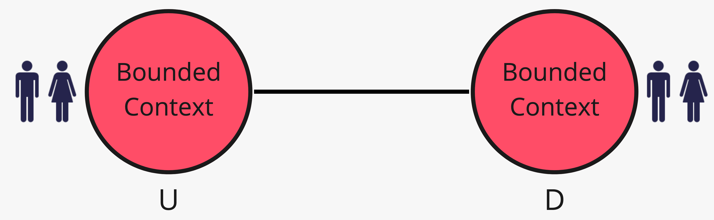

Actions of an upstream team will have an effect on the downstream team, but actions of the downstream do not have a significant impact on the upstream team. "The upstream team may succeed independently of the fate of the downstream team" (Quote from the [DDD Reference by Eric Evans](https://www.domainlanguage.com/ddd/reference/)).

#### Free

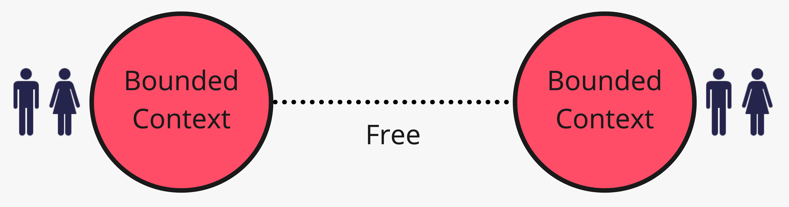

A Bounded Context or a team that works in it is free if changes in other Bounded Contexts do not influence its success or failure. There is, therefore, no organizational or technical link of any kind between these teams.

### Context Map Patterns

Most publications in the Domain-Driven Design community currently describe nine context mapping patterns. 

#### Open-host Service

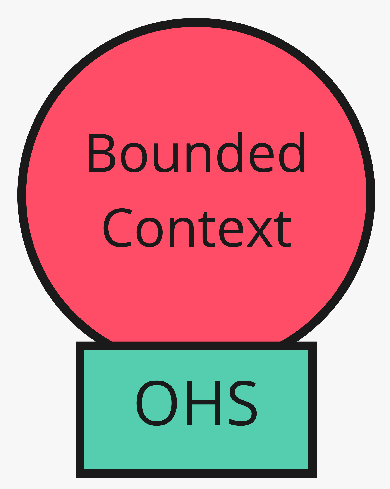

"A protocol that gives access to your subsystem as a set of services. Open the protocol so that all who need to integrate with you can use it. Enhance and expand the protocol to handle new integration requirements, except when a single team has idiosyncratic needs. Then, use a one-off translator to augment the protocol for that special case so that the shared protocol can stay simple and coherent." ([Source: DDD Reference by Eric Evans](https://www.domainlanguage.com/ddd/reference/))

The team providing an Open-host Service is usually in an upstream position whereas the clients using it are downstream teams. The teams on the downstream are free to be conformists or to build anticorruption layers.

#### Conformist

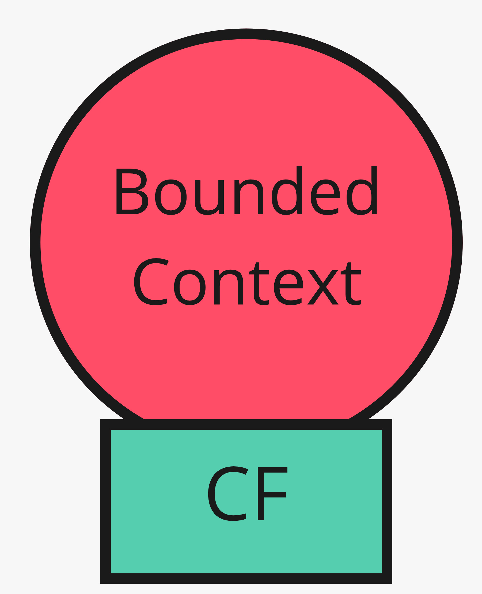

"Eliminate the complexity of translation between bounded contexts by slavishly adhering to the model of the upstream team. Although this cramps the style of the downstream designers and probably does not yield the ideal model for the application, choosing conformity enormously simplifies integration. Also, you will share a ubiquitous language with your upstream team. The upstream is in the driver’s seat, so it is good to make communication easy for them. Altruism may be sufficient to get them to share information with you." ([Source: DDD Reference by Eric Evans](https://www.domainlanguage.com/ddd/reference/))

#### Anticorruption Layer

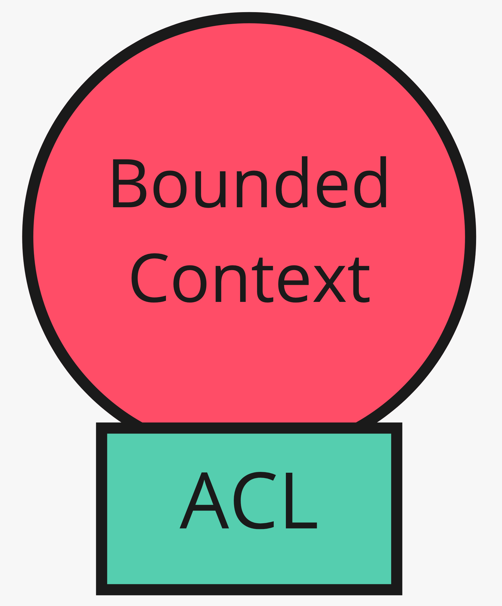

"As a downstream client, create an isolating layer to provide your system with functionality of the upstream system in terms of your own domain model. This layer talks to the other system through its existing interface, requiring little or no modification to the other system. Internally, the layer translates in one or both directions as necessary between the two models." ([Source: DDD Reference by Eric Evans](https://www.domainlanguage.com/ddd/reference/))

#### Shared Kernel

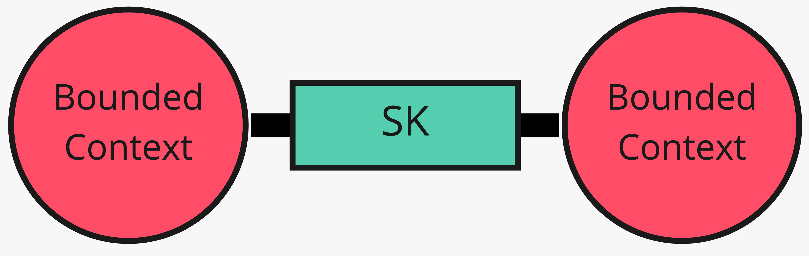

"Designate with an explicit boundary some subset of the domain model that the teams agree to share. Keep this kernel small.Within this boundary, include, along with this subset of the model, the subset of code or of the database design associated with that part of the model. This explicitly shared stuff has special status, and shouldn’t be changed without consultation with the other team." ([Source: DDD Reference by Eric Evans](https://www.domainlanguage.com/ddd/reference/))

#### Partnership

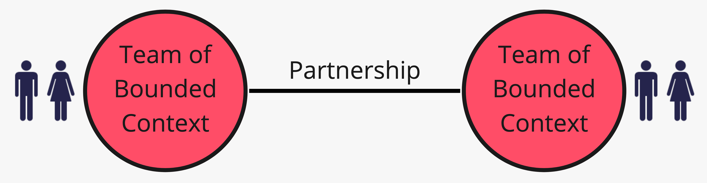

"Where development failure in either of two contexts would result in delivery failure for both, forge a partnership between the teams in charge of the two contexts. Institute a process for coordinated planning of development and joint management of integration. 
The teams must cooperate on the evolution of their interfaces to accommodate the development needs of both systems. Interdependent features should be scheduled so that they are completed for the same release." ([Source: DDD Reference by Eric Evans](https://www.domainlanguage.com/ddd/reference/))

#### Customer / Supplier Development

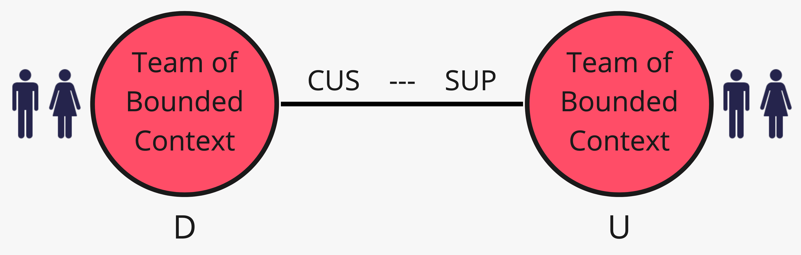

"When two teams are in an upstream-­downstream relationship, where the upstream team may succeed independently of the fate of the downstream team, the needs of the downstream come to be addressed in a variety of ways with a wide range of consequences. [...] Establish a clear customer/supplier relationship between the two teams, meaning downstream priorities factor into upstream planning. Negotiate and budget tasks for downstream requirements so that everyone understands the commitment and schedule." ([Source: DDD Reference by Eric Evans](https://www.domainlanguage.com/ddd/reference/))

#### Published Language

"The translation between the models of two bounded contexts requires a common language. [...] Use a well-documented shared language that can express the necessary domain information as a common medium of communication, translating as necessary into and out of that language." ([Source: DDD Reference by Eric Evans](https://www.domainlanguage.com/ddd/reference/))

Widely known examples for a Published Language are iCalendar or vCard. Published language is often combined with an open-host service.

#### Separate Ways

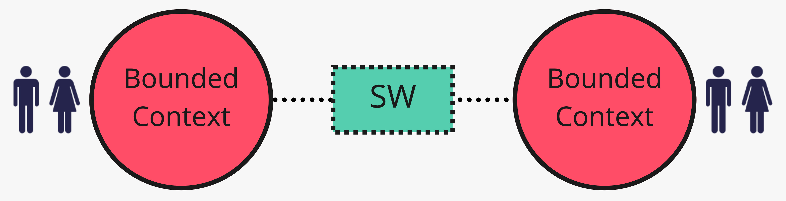

When two bounded contexts have no significant relationship they can be separated.
"Declare a bounded context to have no connection to the others at all, allowing developers to find simple, specialized solutions within this small scope" ([Source: DDD Reference by Eric Evans](https://www.domainlanguage.com/ddd/reference/))

#### Big Ball Of Mud

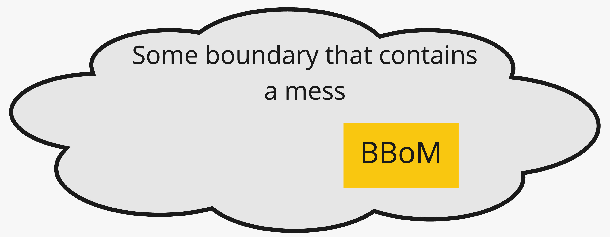

A (part of a) system which is a mess by having mixed models and inconsistent boundaries. Don't let this lousy model propagate into the other Bounded Contexts. Big Ball Of Mud is a demarcation of a bad model or system quality. You want to make sure, that this mess does not propagate into other bounded contexts.

## Best practices for Context Maps

There is no need to put all the patterns and team relationships into one big context map. Such a context map will grow over time and it will become hard to understand. You will be forced to explain such a complex context map to big amount of various stakeholders who all have different perspectives due to their roles or the nature of their work. Therefore, it is recommended to mind those hints:

- Prefer small context maps for explicit questions
- Document and explain the patterns your are going to use
- Work with different perspectives and multiple context maps for those perspectives

### Small context maps for explicit questions

Context Maps are able to answer a high variety of questions such as:

- how does the model of a given system propagate through an application landscape?
- which kind of influence does a certain team have on others?
- who has an influence on a given team?
- how are politics being played?

As you can see: these questions are very specific and we can answer them based on a big context map but such a context map will sooner or later turn into an information overload.

Therefore: 

Work with smaller context maps, aimed to answer specific questions. Only include those patterns to these smaller context maps that help you in answering these questions.

### Document and explain the patterns you are going to use

Context Mapping is a powerful technique to visualize relationships between systems and teams. However they can become hard to understand for people who are not experienced with Domain-Driven Design or the context mapping patterns. Even some pattern names are not self-explanatory for certain groups of stakeholders and the same applies to some of the definitions.

Therefore:

Before you start drawing context maps you should decide which of the patterns you are going to use and you will do yourself and the stakeholders of your context map a big favour by providing an explanation of those patterns. Make sure that all folks working with your context map do understand the patterns. Examples are always a good idea for such explanations.

## Context Map Cheat Sheet

Here is a cheat sheet containing brief descriptions of the context mapping patterns:

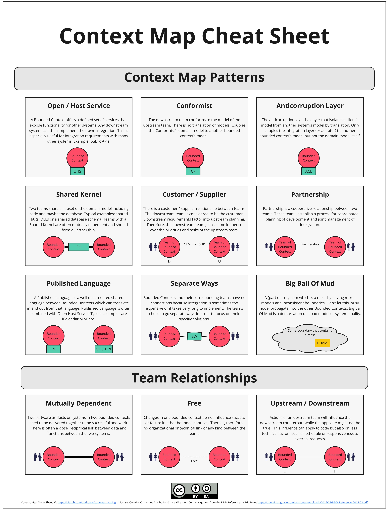

## Remote Context Mapping Starter Kit for Miro

If you perform context mapping with Miro, there is a board backup that gets you started with all the objects for the patterns, team relationships and boundaries. In addition to that the Miro board contains a few examples to get you started:

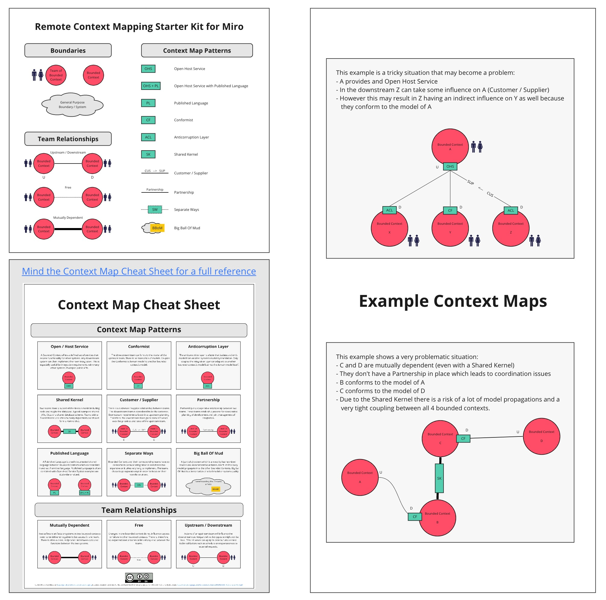

[Link to Miro Board Backup](resources/Remote-Context-Mapping-Starter-Kit.rtb)

You can also check out (and comment) [a read-only version of the starter kit on Miro](https://miro.com/app/board/o9J_kqtuB6A=/)

## Context Mapping with Context Mapper

If you want to maintain your context maps in your code repo, [Context Mapper](https://contextmapper.org/) allows you to describe your contexts in a text file and generate a diagram from it. [Context Mapper](https://contextmapper.org/) is available [online (in the browser via Gitpod)](https://contextmapper.org/docs/online-ide/) or via IDE plugins for [Visual Studio Code](https://marketplace.visualstudio.com/items?itemName=contextmapper.context-mapper-vscode-extension) and [Eclipse](https://marketplace.eclipse.org/content/context-mapper/).

## Further Reading

- [Dynamic Reteaming](https://leanpub.com/dynamicreteaming) 
- [Pioneers, Settlers & Town Planners](http://wardleypedia.org/mediawiki/index.php/Pioneers_settlers_town_planners)
- [Team Topologies](https://teamtopologies.com/)
- [Visualising Sociotechnical Architecture with Context Maps](https://speakerdeck.com/mploed/visualizing-sociotechnical-architectures-with-context-maps)

## Contributors

Thanks to all [existing and future contributors](https://github.com/ddd-crew/context-mapping/graphs/contributors) and to the following individuals who have all contributed to the Context Map Cheat Sheet:

- [Kacper Gunia](https://twitter.com/cakper)
- [Nick Tune](https://github.com/ntcoding)

## Contributions and Feedback

The Context Map Cheat Sheet is freely available for you to use. In addition, your feedback and ideas are welcome to improve the technique or to create alternative versions.

If you have questions you can ping us or open an [Issue](https://github.com/ddd-crew/context-map-cheat-sheet/issues/new/choose).

Feel free to also send us a pull request with your examples or experience reports.

You can also comment directly on the [Miro board of the Context Map Cheat Sheet](https://miro.com/app/board/o9J_kqrI8ck=/)

[![CC BY 4.0][cc-by-shield]][cc-by]

This work is licensed under a [Creative Commons Attribution 4.0 International
License][cc-by].

[![CC BY 4.0][cc-by-image]][cc-by]

[cc-by]: http://creativecommons.org/licenses/by/4.0/
[cc-by-image]: https://i.creativecommons.org/l/by/4.0/88x31.png
[cc-by-shield]: https://img.shields.io/badge/License-CC%20BY%204.0-lightgrey.svg
